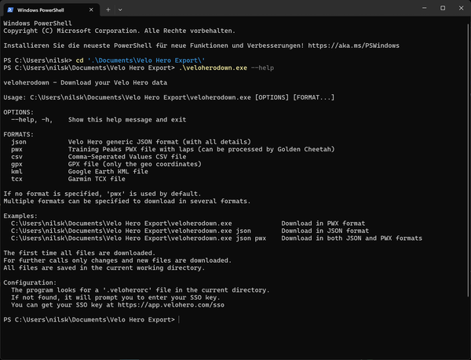
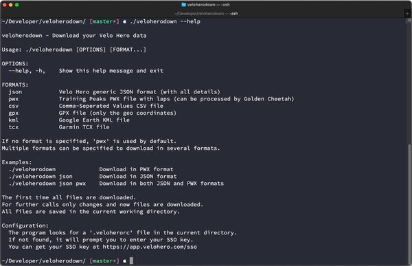

# veloherodown

Create a local copy of your [Velo Hero](https://www.velohero.com/) data.


This command line application creates an export of your recorded activities to Velo Hero.

The first time all the files are downloaded.
For further calls only changes and new files are downloaded.

The export is stored in your chosen format(s): `JSON`, `PWX`, `CSV`, `GPX`, `KML`, or `TCX`.

The JSON file contains all the details except the comments of other users.
The PWX file also has many details and can be processed by [Golden Cheetah](http://www.goldencheetah.org/).
The filename is the ID of the activity (`https://app.velohero.com/workouts/show/<ID>`).

## Setup

1. Create a directory for your Velo Hero export
1. [Download](https://github.com/Cyclenerd/veloherodown/releases/latest) the veloherodown application for your operating system and CPU architecture. If you are unsure, usually `x86_64` will work.
    *  **Windows**
        * [x86_64](https://github.com/Cyclenerd/veloherodown/releases/latest/download/veloherodown-windows-x86_64.exe) Intel or AMD 64-Bit CPU
        * [arm64](https://github.com/Cyclenerd/veloherodown/releases/latest/download/veloherodown-windows-arm64.exe) Arm-based 64-Bit CPU
    *  **macOS**
        * [x86_64](https://github.com/Cyclenerd/veloherodown/releases/latest/download/veloherodown-macos-x86_64) Intel 64-bit CPU
        * [arm64](https://github.com/Cyclenerd/veloherodown/releases/latest/download/veloherodown-macos-arm64) Apple silicon 64-bit CPU (M1, M2...)
    *  **Linux**
        * [x86_64](https://github.com/Cyclenerd/veloherodown/releases/latest/download/veloherodown-linux-x86_64) Intel or AMD 64-Bit CPU
        * [arm64](https://github.com/Cyclenerd/veloherodown/releases/latest/download/veloherodown-linux-x86_64) Arm-based 64-Bit CPU (i.e. Raspberry Pi)
1. Rename it to:
    * `veloherodown` (macOS, Linux)
    * `veloherodown.exe` (Windows)
1. Go to <https://app.velohero.com/sso> to get your private single sign-on key
1. Run the application - it will prompt you to enter your SSO key
    * Open a command line window (see below for instructions).
    * Navigate to the folder where you saved `veloherodown`.
    * Run the tool. It will ask you for your secret key. You can also create a file called `.veloherorc` in that folder and add the key there.
    * Alternatively, create a `.veloherorc` file in the directory with:
        ```ini
        VELOHERO_SSO_KEY=[insert your SSO key]
        ```

## Usage

This project require you to use a command-line interface.
Don't worry, it's easier than it looks!
Here's how to open one:

## Windows (PowerShell)

1. Press the <kbd>Windows key</kbd> + <kbd>X</kbd>.
1. Choose "Windows PowerShell".
1. Type `cd` followed by the path to your folder (e.g., `cd C:\Users\YourName\Documents\VeloHero`) and press Enter.
1. Type `veloherodown.exe` and press Enter.

Screenshot:



Video:

https://github.com/user-attachments/assets/dc3cf10a-be99-40c6-a7cd-3b927109f025

## macOS (Terminal)

1. Press <kbd>Command</kbd> + <kbd>Space</kbd>.
1. Type "Terminal" and press Enter.
1. Type `cd` followed by the path to your folder (e.g., `cd /Users/YourName/Documents/VeloHero`) and press Enter.
1. Type `chmod +x veloherodown` and press Enter. (This makes the tool work).
1. Type `./veloherodown` and press Enter.

Screenshot:



## Export Format

You can choose what kind of files you want to save.

**To use different formats:**

* Windows:
    ```powershell
    veloherodown.exe [FORMAT]
    ```
* macOS and Linux:
    ```bash
    ./veloherodown [FORMAT]
    ```

Replace `[FORMAT]` with one or more of these:

* `json`: Velo Hero generic JSON format (with all details)
* `pwx` : Training Peaks PWX file with laps (can be processed by Golden Cheetah)
* `csv` : Comma-Seperated Values CSV file
* `gpx` : GPX file (only the geo coordinates)
* `kml` : Google Earth KML file
* `tcx` : Garmin TCX file

The default format is PWX.

Example (This saves your data in both JSON and PWX formats):

```bash
veloherodown json pwx
```

All files will be downloaded to the current directory where the `.veloherorc` file is located.

## Features

* Downloads only new or changed activities since the last run
* Supports multiple export formats
* Automatically skips already downloaded files
* Respects server load with appropriate delays between requests
* Simple configuration with a single SSO key

## Notes

The application stores a tracking file `.velohero_last_export.do_not_remove` in the current directory to keep track of the last export timestamp. Do not delete this file if you want incremental updates.
